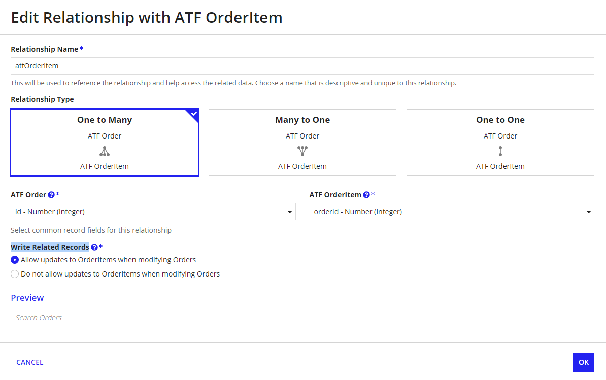

# Configure Write Records Smart Service
- allows you to **write to the base record** and **related records** that are configured with a **one to many** or a **one to one relationship**
- to enable related records to be updated when the based record is updated you must enable **Write Related Records** on the record type relationship

1. Go to the Setup tab
    - select a process variable or write an expression to specify the records to update
2. Go to Data tab(allows you to add additional inputs and store the resulting node outputs)
    - **Ouputs** ---> Results ---> **Records Update** 
    - add the **record pv** to the **Target** property
3. Go to the Assignment tab and select **Run as whoever designed this process model**
    - because writing data to source table requires a higher level of permission which a regular business user does not have

## Create records and related records
- create a form that allows users to update different types of data from different record types, and then pass that information to a process model

- The Write Records smart service will automatically write the data to the selected record type and any of its related record types.

You can write records and related records in the same node as long as the relationship configuration allows it and the records share one data source

- https://docs.appian.com/suite/help/23.3/manage-record-data.html